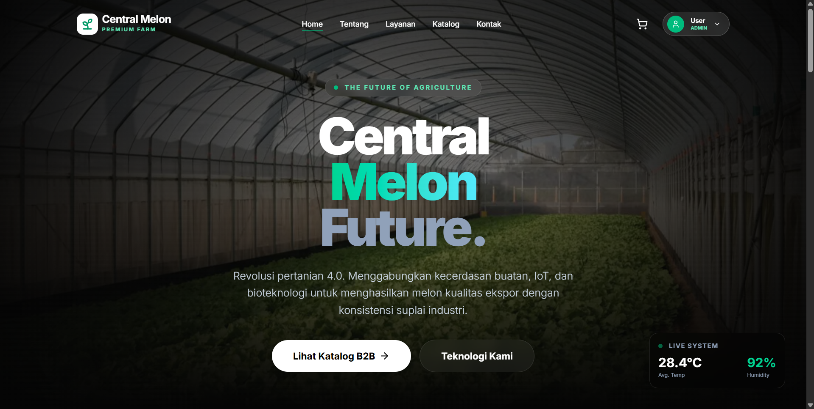
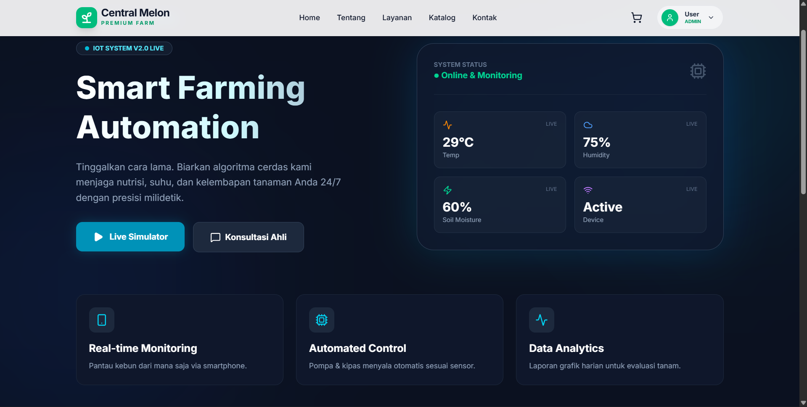
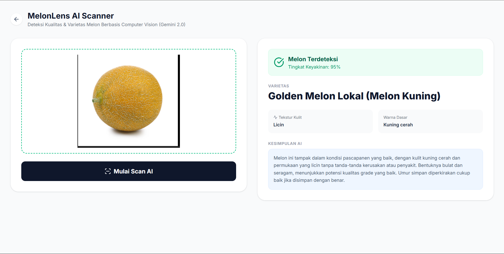
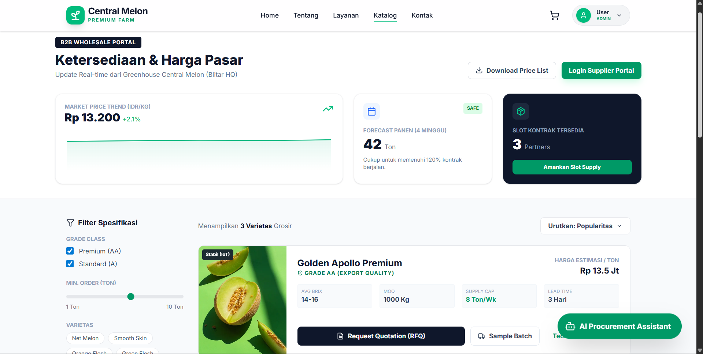

# Central Melon – The Future of Smart Farming Ecosystem

> **Revolusi Pertanian 4.0: Platform Ekosistem Agrikultur Terintegrasi dari Hulu (IoT & AI) hingga Hilir (B2B Supply Chain).**

Ini adalah ekosistem digital terintegrasi yang memberdayakan petani melalui teknologi pertanian presisi (precision farming) dan menghubungkan hasil panen mereka secara langsung ke pasar industri (B2B) seperti hotel, pabrik, dan supermarket.

Proyek ini dibangun sebagai solusi end-to-end yang menggabungkan perangkat keras IoT, kecerdasan buatan berbasis agronomi, dan sistem manajemen rantai pasok digital, semuanya dalam satu antarmuka berbasis web.


[](https://centralmelon-smartfarm.vercel.app)

**[Lihat Live Demo Aplikasi](https://central-melon.vercel.app)**

---

<details>
  <summary>Daftar Isi</summary>
  <ol>
    <li>
      <a href="#tentang-proyek">Tentang Project</a>
    </li>
    <li>
      <a href="#fitur-unggulan">Fitur Unggulan</a>
      <ul>
        <li><a href="#1-artificial-intelligence-ai">Artificial Intelligence</a></li>
        <li><a href="#2-real-time-iot-command-center">Real-time IoT Command Center</a></li>
        <li><a href="#3-b2b-supply-chain-engine">B2B Supply Chain Engine</a></li>
      </ul>
    </li>
    <li><a href="#galeri-aplikasi">Galeri Aplikasi</a></li>
    <li><a href="#stack-teknologi">Stack Teknologi</a></li>
    <li><a href="#panduan-instalasi-lokal">Panduan Instalasi Lokal</a></li>
  </ol>
</details>

---
## Tentang Proyek

Central Melon dirancang untuk menjawab dua tantangan utama di sektor pertanian melon:

1. Kesenjangan teknologi – Petani kesulitan mengakses alat monitoring dan rekomendasi budidaya berbasis data.
2. Ketidakefisienan rantai pasok – Hasil panen sering kali dijual melalui perantara dengan harga tidak transparan.

Dengan platform ini, petani dapat:

- Memantau dan mengontrol lingkungan greenhouse secara real-time,
- Mendiagnosis penyakit tanaman dan menerima rekomendasi nutrisi spesifik,
- Menjual hasil panen langsung ke pembeli B2B dengan harga berbasis data pasar.

---

## Fitur Unggulan

Aplikasi ini mengimplementasikan teknologi *bleeding edge* (Advanced Tech Bonus):

### 1. Artificial Intelligence (AI)
* **MelonBot (Kolosal/Claude 4.5):** Asisten chat cerdas untuk konsultasi penyakit dan strategi bisnis.
* **MelonLens (Computer Vision):** Deteksi kualitas dan varietas melon hanya dari foto menggunakan Gemini 2.0 Vision.
* **AI Greenhouse Designer:** Generator blueprint konstruksi greenhouse otomatis berdasarkan luas lahan.
* **Procurement AI:** Asisten negosiasi harga dan estimasi kontrak untuk pembeli B2B.

### 2. Real-time IoT Command Center
* **Web Serial API:** Mengontrol hardware fisik (Arduino/Servo) langsung dari browser tanpa latensi server.
* **Voice Feedback ("Jarvis"):** Sistem memberikan respon suara (TTS) berbahasa Indonesia saat perangkat diaktifkan.
* **Digital Twin:** Mode simulasi realtime untuk monitoring suhu, kelembapan, dan nutrisi.

### 3. B2B Supply Chain Engine
* **Spec-First Catalog:** Katalog khusus supplier dengan data teknis (Brix, MOQ, Capacity).
* **Dynamic Pricing:** Grafik tren harga pasar real-time.
* **Integrated POS:** Sistem kasir offline yang tersinkronisasi dengan stok gudang online.

---

## Stack Teknologi

Kami menggunakan arsitektur modern yang *scalable* dan aman:

* **Frontend:** Next.js 14 (App Router), TypeScript, Tailwind CSS.
* **Visual & Animasi:** GSAP (GreenSock), Framer Motion, Recharts.
* **Backend & Database:** Supabase (PostgreSQL, Auth, Storage, Realtime Subscriptions).
* **AI Engine:** Google Gemini API & Kolosal API (OpenAI Compatible).
* **Hardware Communication:** Web Serial API (Browser-to-Hardware).

---

## Galeri Aplikasi

| **Cinematic Homepage** | **IoT Dashboard (Dark Mode)** |
|:---:|:---:|
|  |  |
| *Landing page interaktif dengan GSAP* | *Kontrol hardware realtime & simulasi* |

| **AI MelonLens** | **B2B Catalog** |
|:---:|:---:|
|  |  |
| *Deteksi penyakit tanaman visual* | *Portal pengadaan khusus industri* |


---

## Panduan Instalasi (Lokal)

Ikuti langkah ini untuk menjalankan proyek di komputer Anda.

### Prasyarat
* Node.js v18+
* NPM / Yarn

### 1. Clone Repository
```bash
git clone [https://github.com/Rafiqalha/centralmelon-smartfarm.git](https://github.com/Rafiqalha/centralmelon-smartfarm.git)
cd central-melon
```
Projek ini Dibuat oleh tim QWERTY :v
